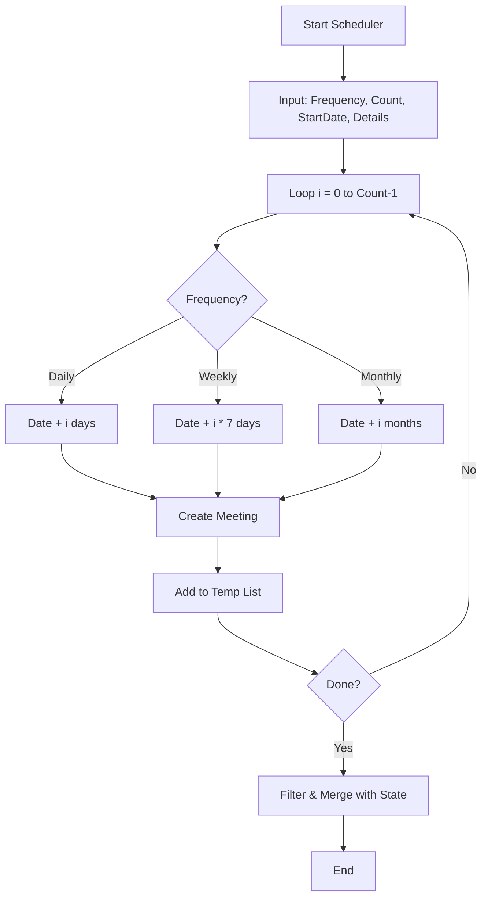

# Meetings System Implementation Plan (Updated)

This document outlines the transition from a static "Events" list to a dynamic "Meetings" system with flexible recurring scheduling, status management, and automatic data cleanup.

## 1. Data Model Changes

Rename `Event` interface to `Meeting` in [`types.ts`](types.ts) and update its structure:

```typescript
export interface Meeting {
    id: string;
    title: string;
    date: string; // ISO format: YYYY-MM-DD
    time: string; // 24h format: HH:MM
    location: string;
    description: string;
    imageUrl?: string;
    status: 'Active' | 'Cancelled';
    cancellationReason?: string; // New field for context on why it was cancelled
}
```

Update `ClubData` to replace `events` with `meetings`.

## 2. Auto-Cleanup Logic (Data Deletion)

To keep the `metadata.json` clean and performant:
- **Deletion Logic**: Meetings where `new Date(meeting.date + 'T' + meeting.time) < new Date()` (past meetings) will be removed from the data array.
- **Trigger**: 
    1. **Client-side Filter**: The public view will always filter them out.
    2. **Admin-side Cleanup**: A "Prune Expired Meetings" button in the Admin Portal will filter the array and prompt the user to "Save to GitHub" to persist the deletion.
    3. **Auto-Prune on Save**: (Optional) Automatically filter out past meetings whenever a new meeting is added or the scheduler is run.

## 3. Recurring Scheduler (Admin Portal)

A flexible generation tool in [`AdminPortal.tsx`](components/AdminPortal.tsx).

### Input Parameters:
- `interval`: 'Daily' | 'Weekly' | 'Monthly' | 'Custom'
- `count`: Number of occurrences
- `startDate`, `startTime`, `title`, `location`, `description`

### Generation Logic:
1. Loop `i` from 0 to `count - 1`:
   - `currentDate = new Date(startDate)`.
   - If 'Daily': `currentDate.setDate(currentDate.getDate() + i)`.
   - If 'Weekly': `currentDate.setDate(currentDate.getDate() + (i * 7))`.
   - If 'Monthly': `currentDate.setMonth(currentDate.getMonth() + i)`.
   - Generate `Meeting` object with unique ID.
2. Resulting list is merged with `ClubData.meetings`.

## 4. UI/UX Updates

### Public "Meetings" Component
- **Visibility**: Only show 'Active' or 'Cancelled' meetings that are in the future.
- **Status Badge**: If `status === 'Cancelled'`, show a prominent "CANCELLED" overlay or badge.
- **Reason**: Display `cancellationReason` if present on cancelled meetings.

### Admin Portal
- **Management Tab**: Rename "Events" to "Meetings".
- **Scheduler UI**:
    - Dropdown for frequency (Daily, Weekly, Monthly).
    - Input for number of occurrences.
    - Fields for title, loc, desc.
- **Meeting List**:
    - Status toggle (Active/Cancelled).
    - If 'Cancelled', show an input field for `cancellationReason`.
    - "Prune Expired" button to remove old data.

## 5. Implementation Steps

1. **Phase 1: Refactoring**
   - Global rename of `Event` to `Meeting`.
   - Component renaming and route updates.
2. **Phase 2: Data & Types**
   - Update `types.ts` with `status` and `cancellationReason`.
   - Update `INITIAL_DATA` in `App.tsx`.
3. **Phase 3: Flexible Scheduler**
   - Implement the multi-interval generation logic in `AdminPortal.tsx`.
4. **Phase 4: Cleanup & UI**
   - Implement the pruning logic.
   - Update `Meetings.tsx` to handle status badges and reasons.

## 6. Mermaid Diagram: Flexible Scheduler


