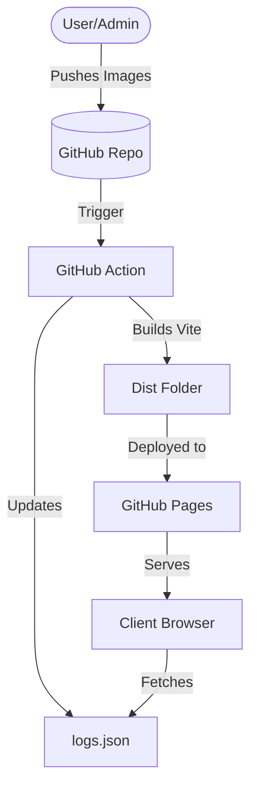

# Technical Specification: LAHS Aviation Website Enhancements

## 1. Secure Admin Access
The goal is to remove the hardcoded password `aviation` from [`components/AdminPortal.tsx`](components/AdminPortal.tsx) and implement a secure verification method that works on a static GitHub Pages site without a traditional persistent backend.

### Proposed Solution: Environmental Variable + Hashing
1.  **Environment Variable**: Store the admin passkey in a GitHub Secret (e.g., `VITE_ADMIN_PASSKEY_HASH`).
2.  **Build-time Injection**: During the GitHub Actions build process, inject this secret into the Vite build environment.
3.  **Client-side Verification (Hashed)**:
    *   Instead of storing the plain text password, we store a **SHA-256 hash** of the password.
    *   When the user enters a password in [`AdminPortal.tsx`](components/AdminPortal.tsx), the client-side code hashes the input and compares it against `import.meta.env.VITE_ADMIN_PASSKEY_HASH`.
    *   This prevents the plain text password from being visible in the transpiled JavaScript source code (though the hash itself is public, finding the original "aviation" or similar short password is easy, but it's a step up).
4.  **Security Note**: For a student club site on GitHub Pages, this "Security by Hashing" is a reasonable trade-off. For higher security, a lightweight Firebase Auth or Supabase integration would be required.

## 2. GitHub Pages Hosting Configuration
The site currently uses `HashRouter`, which is excellent for GitHub Pages as it avoids 404 errors on refresh without complex server-side redirects.

### Necessary Changes:
1.  **Base Path**: Update [`vite.config.ts`](vite.config.ts) to include the `base` property if the site is hosted at `username.github.io/repo-name/`.
    ```typescript
    base: '/LAHSAviationWebsite/',
    ```
2.  **Deployment Workflow**: Create a [`.github/workflows/deploy.yml`](.github/workflows/deploy.yml) file to automate the build and deploy process using GitHub Actions.

## 3. Content & Media Management (Project Logs)
The goal is a media-rich, folder-based update system that supports images, multiple videos, and flexible folder naming.

### Proposed Solution: The "Universal Project Folder"
We will use `/public/projects/` as the root for all project-related media and documentation.

1.  **Directory Structure**:
    ```text
    /public/projects/
      ├── [project-name]/
      │   ├── 2024-10-25-First-Flight/    <-- "Update" Folder with date
      │   │   ├── desc.txt                <-- Update description
      │   │   ├── video1.mp4              <-- Video support
      │   │   ├── video2.webm             
      │   │   ├── photo.jpg               
      │   │   └── photo2.png              
      │   └── Projects-Arrival/             <-- "Update" Folder NO date
      │       ├── desc.txt
      │       └── arrival.mp4
    ```

2.  **The Media Workflow**:
    *   **Videos & Images**: The system will automatically detect `.mp4`, `.webm`, `.mov` for videos and `.jpg`, `.png`, `.gif`, `.webp` for images.
    *   **Multiple Videos**: Carousels will support mixing both images and videos in a single view.
    *   **Folder Naming**:
        *   If a folder starts with `YYYY-MM-DD`, it uses that date for sorting.
        *   If no date is found, it uses the **file creation/commit date** from Git (handled by the indexing script) as a fallback, or treats it as an "evergreen" update.

3.  **Where to Input (GitHub Workflow)**:
    *   **Branch**: Everything should be committed to the **`main` branch**.
    *   **Method**: 
        1. Open the repository on GitHub.com.
        2. Navigate to `public/projects/`.
        3. Create a new folder (or upload to an existing one) using the GitHub "Add file" -> "Upload files" button.
        4. Once committed, the **GitHub Action** will automatically rebuild the site and update the "Projects" logs.
    *   **Benefit**: This keeps the history of the website and the project media in one place, synchronized.

4.  **The "Smart" Frontend**:
    *   A build-time indexing script will generate `projects-index.json`.
    *   The React app will use this index to build the UI dynamically, so you never have to touch a `.tsx` file to add a new project update.

## 5. Admin Portal & Project Lifecycle
Since we are on a static site, "Saving" in the Admin Portal usually just downloads a JSON or copies it to the clipboard. We will improve this using **GitHub API Integration**.

### The "Save" Workflow:
1.  **Admin Login**: Use the hashed passkey to enter the portal.
2.  **Edit/Create**: Change a project title or add a new project (e.g., "Solar Glider").
3.  **The "Commit" Button**: Instead of a generic save, we'll have a "Deploy Changes" button in the Admin Portal.
4.  **GitHub API Call**: 
    *   The browser will prompt you for a **GitHub Personal Access Token (PAT)** (which the Admin stores locally/session).
    *   The website calls the GitHub API to update `data/projects.json` directly in the repository.
5.  **Chain Reaction**:
    *   GitHub sees the change to `projects.json`.
    *   The **Build Workflow** starts.
    *   The **Self-Healing Script** sees "Solar Glider" is new and creates the folder `/projects/solar-glider/` in the Content repo.
    *   The website is rebuilt and live in minutes.

### Benefits:
*   **True CMS Experience**: It feels like a real backend, but it's just using GitHub as the database.
*   **Zero Infrastructure**: No servers to pay for or maintain.
*   **Audit Trail**: You can see exactly who changed what in the GitHub commit history.

### Auto-Provisioning of Folders
*   **The Problem**: If a new project is created on the website, its content folder doesn't exist yet in the "Dump" repo.
*   **The Solution**: The website's indexing script will be "self-healing."
    1. It compares the projects defined in `data/projects.json` (the master list) with the folders in the `AviationProjectsContent` repo.
    2. If a project is missing a folder, the script **automatically generates it** (with a placeholder `desc.txt`) during the build process and can even commit it back to the content repo via the GitHub Action.
    3. On the frontend, if a folder is empty, it will display a friendly "Project update pending... upload photos to begin!" message instead of breaking.

## Implementation Steps (Todo List for Code Mode)
1.  **Update Configs**: Modify [`vite.config.ts`](vite.config.ts) and [`package.json`](package.json).
2.  **Admin Security**: Implement SHA-256 hashing in [`components/AdminPortal.tsx`](components/AdminPortal.tsx).
3.  **Project Logs System**:
    *   Create `/public/projects/` folder structure.
    *   Create `data/projects.json` (moving data out of [`App.tsx`](App.tsx)).
    *   Implement logic to fetch and render these projects.
4.  **Deployment**: Create the GitHub Actions workflow.

## System Architecture Diagram

